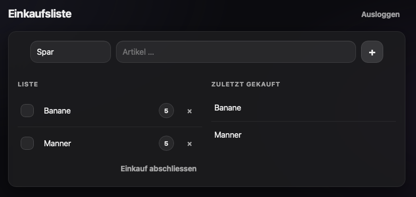

# 🛒 ShopList

> A tiny, blazing-fast, self-hosted shopping list for families — no cloud, no nonsense.

[](https://golang.org)
[](https://sqlite.org)
[](LICENSE)
[](https://web.dev/progressive-web-apps/)

**Works on iPhone (Safari) and GrapheneOS · Installable as a PWA · Single binary · Zero subscriptions**



## 🤔 Why ShopList?

Most shopping list apps are either cloud-first, bloated, or privacy-hostile. **ShopList** is built for people who want full control:

| Problem with other apps           | ShopList's answer             |
| --------------------------------- | ----------------------------- |
| ☁️ Requires cloud accounts & sync | 🏠 100% self-hosted           |
| 🏗️ Heavy framework stacks         | ⚡ Single Go binary           |
| 💾 Multiple services & databases  | 🗄️ One SQLite file            |
| 👤 Complex user management        | 🔑 Shared household password  |
| 💸 Subscriptions                  | 🆓 MIT licensed, free forever |

> _Follows the Unix philosophy: do one thing well._

## ✨ Features

- 🔐 **Shared household login** via password session
- 🏪 **Multiple shops** (e.g. Spar, Billa, Bauernladen)
- 🚫 **No duplicates** per shop
- ✅ **Check/uncheck items** with one tap
- 🧹 **Clear completed items** instantly
- 🕐 **"Last used" history** per shop
- ⚖️ **Optional quantity** per item — free text: `2`, `10 dag`, `250 g`, …
- 📱 **PWA installable** on iOS + GrapheneOS (Add to Home Screen)

## 🧱 Tech Stack

| Layer      | Technology                        |
| ---------- | --------------------------------- |
| Backend    | Go (`net/http`)                   |
| Database   | SQLite (single file, WAL enabled) |
| Frontend   | HTML + minimal JS + CSS           |
| Frameworks | _(none)_                          |

## 🚀 Quick Start

### Requirements

- Go 1.25+

### Run locally

```bash
export SHOPLIST_PASSWORD='your-long-household-passphrase'
export SHOPLIST_DATA_DIR='./data'
export SHOPLIST_ADDR=':8080'
export SHOPLIST_SHOPS='Spar,Billa,Bauernladen'
export SHOPLIST_DEFAULT_SHOP='Spar'
export SHOPLIST_COOKIE_SECURE='0'

go run ./cmd/shoplist
```

Open [http://localhost:8080](http://localhost:8080) and start shopping. 🎉

## 🔨 Build

```bash
go build -o shoplist ./cmd/shoplist
```

## ⚙️ Configuration

| Variable                    | Description                            |
| --------------------------- | -------------------------------------- |
| `SHOPLIST_ADDR`             | Listen address (e.g. `:8080`)          |
| `SHOPLIST_PASSWORD`         | Shared household password _(required)_ |
| `SHOPLIST_DATA_DIR`         | Directory for SQLite DB                |
| `SHOPLIST_SESSION_TTL_DAYS` | Session duration in days               |
| `SHOPLIST_COOKIE_SECURE`    | Set `1` when running behind HTTPS      |
| `SHOPLIST_SHOPS`            | Comma-separated shop list              |
| `SHOPLIST_DEFAULT_SHOP`     | Default selected shop                  |

## 🏗️ Deployment

### 🐧 Debian LXC (recommended for Proxmox homelabs)

1. Create a Debian LXC container (1 vCPU, 512 MB RAM is plenty)
2. Copy the binary: `cp shoplist /usr/local/bin/shoplist`
3. Create data dir: `mkdir -p /var/lib/shoplist`
4. Set up a systemd service (see below)
5. Put it behind an HTTPS reverse proxy (HAProxy, Caddy, nginx, …)

**View logs:**

```bash
journalctl -u shoplist -f
```

### 🐳 Docker

```bash
docker compose up -d --build
```

## 💾 Backups

The entire state lives in one file:

```
$SHOPLIST_DATA_DIR/shoplist.db
```

Back up the whole directory. That's it. Restore by copying it back. 🎯

## 🔒 Security

- Use a **long passphrase** (20+ characters)
- Always run behind **HTTPS**
- Set `SHOPLIST_COOKIE_SECURE=1` in production

## 📄 License

MIT - use it, fork it, self-host it. ❤️
